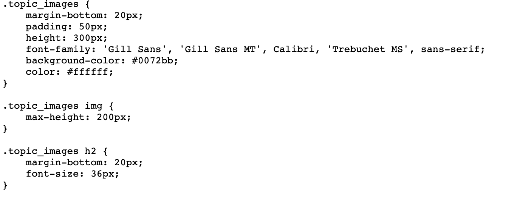

# Code Refactor 
I was given the task of code refractoring Horiseon's webpage. The criteria was that it needed to include semantic HTML elements, follow a logical structure, improve on accessbility, and improve overall in structure; yet keeping the cosemetic appearance untouched.

## Get Started
First, I located the file in their github in order to find the SSH link. 

### Installing

After copying the SSH link, I first used Git to retrieve the existing code from the company. Using the company's SSH, I was able to clone the website onto my own machine. 

Using this line of code:

```
git clone *ssh link*
```
### Improvements

First, I converted many of the ```<div>``` tags into more descriptive semantic tags. Such as ```<header>```, and ```<footer>```. Additionally, I made structural changes to the hero class. I entirely removed the class because I wanted to import the image through html and not css. I did this because I strictly only wanted styling in csss. Furthermore, I condensed the styling by grouping multiple sections in the same class. 



In the screen shot above you can see there is no repeated attribute. 

In addition to making the website more accessible by adding semantic elements, I also included alt attributes to the images. 

Furtheremore, I fixed the functionality with the Search Engine Optimization link. Prior, it did not navigate to the search engine optimization section. The link did not work becuase the ```<div>``` tag was missing the `id` attribute.


###

## Link
* [Horiseon Code Refactoring]( https://danielvo1.github.io/code_refractor/)

## Built With

* [HTML](https://developer.mozilla.org/en-US/docs/Web/HTML)
* [CSS](https://developer.mozilla.org/en-US/docs/Web/CSS)


## Authors
Daniel Vo 